```mermaid
flowchart TD
    A[User Starts App] --> B{Select Mode}

    B --> C1[Chat Assistant]
    B --> C2[Doc/Image Analysis]
    B --> C3[Voice Command]
    B --> C4[Live Webcam]
    B --> C5[Screen Analysis]
    B --> C6[Take Picture]
    B --> C7[Marketing Email]
    B --> C8["Freight Calculators (External)"]
    B --> C9["Basic Estimators (Illustrative)"]
    B --> C10["Drone Sim (Conceptual)"]

    subgraph Input_Context_Processing ["Input & Context Processing"]
        C1 --> I_Chat["User Text/File/Image/Cam Context"]
        KB["Internal Knowledge Base (URLs, DOCX)"] --> CTX_Agg["Aggregate Chat Context"]
        I_Chat --> CTX_Agg
        CTX_Agg --> AI_Chat["Gemini for Chat"]

        C2 --> I_Analysis["User Docs/Images + Prompt"]
        I_Analysis --> AI_Analysis["Gemini for Analysis"]

        C3 --> I_Voice["Record Voice"]
        I_Voice --> VTT["Transcribe Audio"]
        VTT --> AI_Voice["Gemini for Voice Cmd"]

        C4 --> I_Webcam["Webcam Feed Input"]
        I_Webcam --> AI_Webcam["Gemini for Webcam Vision"]

        C5 --> I_Screen["Screen Share + User Prompt"]
        I_Screen --> AI_Screen["Gemini for Screen Vision"]

        C6 --> I_Picture["Capture Picture + User Prompt"]
        I_Picture --> AI_Picture["Gemini for Picture Vision"]

        C7 --> I_Mkt_Contacts["Upload/Enter Contacts"]
        I_Mkt_Contacts --> I_Mkt_Compose{"Compose Email Option"}
        I_Mkt_Compose -- "AI Prompt" --> AI_Mkt_Gen["Gemini for Mkt Content"]
        I_Mkt_Compose -- "Manual/Edit" --> MKT_Content["Final Mkt Email Content"]
        AI_Mkt_Gen --> MKT_Content

        C8 --> I_Calc["User Interacts with Embedded Calculators"]

        C9 --> I_Estim["User Inputs for Basic Estimators"]
        I_Estim --> EST_Logic["Run Simplified Estimations Logic"]

        C10 --> I_Drone["User Selects Drone/Target for Sim"]
        I_Drone --> DRONE_Sim_Logic["Simulate Drone Actions & Update Map Data"]
    end

    subgraph AI_Action_Output ["AI Processing, Action & Output Generation"]
        AI_Chat --> RESP_Chat["Chat Response Generated"]
        AI_Analysis --> RESP_Analysis["Analysis Result Generated"]
        AI_Voice --> RESP_Voice["Voice Cmd Response Generated"]
        AI_Webcam --> RESP_Webcam["Webcam Analysis Output"]
        AI_Screen --> RESP_Screen["Screen Analysis Output"]
        AI_Picture --> RESP_Picture["Picture Analysis Output"]
        MKT_Content --> MKT_Email_Logic["Prepare Mkt Emails for Sending"]
        EST_Logic --> RESP_Estim["Estimator Results Calculated"]
        DRONE_Sim_Logic --> RESP_Drone["Update Drone Visuals/Map Data"]

        RESP_Chat --> O_SharedFeatures["Shared Output Features (TTS, Downloads, Quote Check)"]
        RESP_Analysis --> O_SharedFeatures
        RESP_Voice --> O_SharedFeatures
        RESP_Picture --> O_SharedFeatures

        O_SharedFeatures -- "Quote Check Met" --> EMAIL_Q["Prep Quote Email"]
        EMAIL_Q --> SEND_Q["Attempt SMTP Send (Quote)"]
        SEND_Q --> STAT_Q["Display Quote Email Status"]

        MKT_Email_Logic --> SEND_MKT["Attempt SMTP Send (Marketing)"]
        SEND_MKT --> STAT_MKT["Display Mkt Email Status/Progress"]
    end

    subgraph UI_Display ["User Interface Display"]
        RESP_Chat --> UI_Text["Display Text in UI"]
        RESP_Analysis --> UI_Text
        RESP_Voice --> UI_Text
        RESP_Webcam --> UI_Text
        RESP_Screen --> UI_Text
        RESP_Picture --> UI_Text
        MKT_Content --> UI_MKT_Fields["Populate Email Fields in UI"]
        I_Calc --> UI_Calc_Iframe["Display External Calculators (iframe)"]
        RESP_Estim --> UI_Estim_Results["Display Estimator Results in UI"]
        RESP_Drone --> UI_Drone_Map["Display Drone Map & Info in UI"]
        O_SharedFeatures --> UI_Media["Play Audio, Offer Downloads in UI"]
        STAT_Q --> UI_Status["Display Status Messages in UI"]
        STAT_MKT --> UI_Status
    end

    UI_Text --> Z[User Views Results & Interacts Further]
    UI_Media --> Z
    UI_MKT_Fields --> Z
    UI_Calc_Iframe --> Z
    UI_Estim_Results --> Z
    UI_Drone_Map --> Z
    UI_Status --> Z
```

# 🚚✈️🚁 World Movers AI-Agent, Customer Service, Marketing, & Operations Hub v1.1

[](https://www.python.org/)
[](https://streamlit.io)
[](https://deepmind.google/technologies/gemini/)

An advanced Streamlit dashboard designed as an AI-powered multimodal assistant and operational hub for World Movers Phils Inc. This application leverages Google Gemini for sophisticated interactions, enabling users to get information, request quotes, perform marketing tasks, analyze documents/images, use voice commands, access freight calculators, utilize basic logistics estimators, and engage with a drone operations simulation, all within a custom-themed interface.

*(Note: This application is a demonstration and requires API keys and proper setup for full functionality. Some features are simulated.)*

**Devpost Submission:** [World Movers AI-Agent Drone, Customer Service, & Marketing v1.1](https://devpost.com/software/world-movers-ai-agent-customer-service-marketing-agent)
*(Note: This is a project developed for the "AI in Action: Google Cloud Hackathon")*

## 🚀 Live Demo

#### 🤖✈️👉 **[Launch the App](https://worldmovers.streamlit.app/)** *(Link to be updated if necessary)*

## 📸 Application Screenshots

Below are screenshots demonstrating key features and interface elements of the application. *(Consider adding new screenshots for the Calculators, Estimators, and Drone Sim modes)*

| Screenshot | Description |
|------------|-------------|
|  | 📧 Demo of it using Gmail to Request Quotes & Forward Emails, etc. |
|  | ✈️ Main interface or AI-Agent - Chat Assistant Mode |
|  | 🗃️ Upload Doc/Image RAG & Take Picture feature |
|  | 📄 World Movers AI-Agent - Doc/Image Analysis Mode |
|  | 🎙️ World Movers AI-Agent - Voice Command Mode |
|  | 💻 World Movers AI-Agent - Screen Analysis Mode  |
|  | 📧 Demo of Worldmovers AI-agent using Gmail & doing Marketing email |
|  | 📧✨ Worldmovers AI-agent generating subject and body for a marketing email. | 
|  | 📊 Basic Estimators module - Provides core estimation tools for logistics and operations planning |
|   | 🛸 Drone Operations Simulations - Visualizes and manages autonomous drone fleets for realistic scenario testing |
---

> **Tip:**  
> For best visibility, right-click and open images in a new tab, or check the [`screenshots`](https://gitlab.com/hackathon-project-management-tool/world-movers-ai-agent-assistant-v1.0/-/tree/main/screenshots?ref_type=heads) folder for full-resolution files.

## 🚀 Core Features & Interaction Modes

The application is structured around several distinct interaction modes, each tailored for specific tasks:

*   **🤖 Chat Assistant Mode:**
    *   Engage in text-based conversations with the AI.
    *   Ask about services (Air/Sea/Domestic Freight, Customs, Warehousing, Trucking).
    *   Get answers based on internal knowledge: World Movers Terms & Conditions (URL), 'ARE YOU NEW.pdf' (URL), 'importer.docx' (local).
    *   Upload documents (PDF, DOCX, TXT) or images (JPG, PNG, etc.) for contextual chat.
    *   Capture images via webcam for chat context.
    *   Initiate quote requests by providing necessary details (AI can trigger email forwarding).
    *   Text-to-Speech (TTS) for AI responses and download options (DOCX/PDF).
*   **📊 Document/Image Analysis Mode:**
    *   Upload one or more documents or images for in-depth analysis.
    *   Ask specific questions to summarize, compare, or extract information.
    *   AI provides a detailed response, optionally including its reasoning ("AI Thoughts").
    *   TTS and download options for analysis results.
*   **🎤 Voice Command Mode (Optional):**
    *   Speak commands; audio is transcribed and processed by the AI.
    *   Can draw upon internal knowledge. Results include response, thoughts, TTS, and downloads.
    *   *Requires `SpeechRecognition` and `audiorecorder` libraries.*
*   **👁️ Live Webcam Analysis Mode (Optional):**
    *   Stream live video; AI periodically analyzes the feed for logistics-relevant objects/scenes.
    *   *Requires `streamlit-webrtc` and `av` libraries.*
*   **💻 Screen Analysis Mode (Optional):**
    *   Share your screen; use a chat interface to ask the AI about the shared content.
    *   *Requires `streamlit-webrtc` and `av` libraries.*
*   **📸 Take Picture Analysis Mode (Optional):**
    *   Capture a still picture via webcam; ask the AI to analyze it based on your prompt.
    *   *Requires `streamlit-webrtc` and `av` libraries.*
*   **📧 Marketing Email Tool (Optional):**
    *   Upload/manually add contacts.
    *   **✨ AI-Powered Content Generation:** Prompt the AI to draft email subjects and bodies.
    *   Compose/edit emails with personalization. Send via configured SMTP. View progress/results.
    *   *Requires `pandas` and `openpyxl` libraries.*
*   **🛠️ Freight Calculators (External Tools):**
    *   Access embedded versions of external freight calculation tools from Freightos.com:
        *   Freight Rate Calculator
        *   Transit Time Calculator
        *   Import Duty Calculator
        *   Container Shipping Cost Calculator
        *   Emissions Calculator (Sea, Air, Port-to-Port)
    *   Provides direct links if embedding is restricted by the external site.
*   **🧮 Basic Estimators (Illustrative):**
    *   Simplified tools for conceptual understanding (NOT for real-world use):
        *   **Volume & Volumetric Weight:** Calculates CBM and basic volumetric weight for air/sea.
        *   **Simple Transit Time Idea:** Based on user-input distance and speed.
        *   **Basic Duty Idea:** Calculates duty based on a flat percentage of goods value.
        *   **Rough Emissions Idea:** Basic CO2e estimation based on mode, distance, weight, and assumed factors.
    *   Includes strong disclaimers about their illustrative nature.
*   **🚁 Drone Operations Simulation (Conceptual):**
    *   Visualize and interact with a simulated fleet of drones on a map (`st.map`).
    *   Assign targets, "deploy" drones, simulate flight steps, and monitor status/battery.
    *   Demonstrates potential for drone integration in logistics.
    *   *Requires `pandas` library. All operations are simulated.*

## ✨ General Application Features

*   **Custom Themed UI:** Aesthetically styled interface with a World Movers theme.
*   **Robust File Handling:** Supports various file types with error checking.
*   **External Knowledge Integration:** Fetches and utilizes content from predefined URLs and local documents.
*   **Quote Request Forwarding:** AI can trigger an email to the World Movers team with quote details.
*   **Clear Error Reporting:** User-friendly messages for configuration issues or operational errors.
*   **Session State Management:** Persists user interactions and data within a session.

## 📋 Prerequisites

*   Python 3.9+ (Python 3.8+ might work, but 3.9+ recommended for latest library compatibilities)
*   Streamlit
*   Google Gemini API Key
*   SMTP Server Credentials (for email functionality)
*   Required Python libraries (see `requirements.txt` section below)
*   A `data/` directory in the project root containing `importer.docx`.

## ⚙️ Setup & Installation

1.  **Clone the repository:**
    ```bash
    git clone https://your-gitlab-repo-url/world-movers-ai-agent.git # Replace with your actual GitLab repo URL
    cd world-movers-ai-agent
    ```

2.  **Create and activate a virtual environment (Recommended):**
    ```bash
    python -m venv venv
    # On Windows:
    .\venv\Scripts\activate
    # On macOS/Linux:
    source venv/bin/activate
    ```

3.  **Install dependencies:**
    *   Create a `requirements.txt` file in the project root:
        ```txt
        # requirements.txt
        streamlit
        google-generativeai
        Pillow
        pypdf
        python-docx
        fpdf
        requests
        beautifulsoup4
        pandas # Now a core dependency for Estimators and Drone Sim maps
        openpyxl  # For pandas to read .xlsx files (Marketing Tool)
        # Optional Libraries (install based on features needed)
        gTTS
        SpeechRecognition
        # PyAudio (often needed by SpeechRecognition, install platform-specific dependencies if issues)
        streamlit-webrtc
        av
        audiorecorder
        ```
    *   Install the requirements:
        ```bash
        pip install -r requirements.txt
        # If PyAudio is needed and causes issues:
        # Windows: pip install pipwin; pipwin install pyaudio
        # Linux: sudo apt-get install portaudio19-dev python3-pyaudio
        # macOS: brew install portaudio; pip install pyaudio
        ```
    *   Create a directory named `data` in the project root and place your `importer.docx` file inside it.

4.  **Configure Secrets (API Keys, Email Credentials):**
    *   Create a directory named `.streamlit` in the root of your project folder: `mkdir .streamlit`
    *   Inside `.streamlit`, create a file named `secrets.toml`.
    *   Add your credentials to `secrets.toml` with the following structure:

        ```toml
        # .streamlit/secrets.toml

        [gemini_api]
        api_key = "YOUR_ACTUAL_GEMINI_API_KEY"

        [email_credentials]
        sender_email = "your_sending_email@example.com"
        sender_password = "your_email_password_or_app_password" # Use App Password for Gmail if 2FA is enabled
        smtp_server = "smtp.example.com" # e.g., "smtp.gmail.com"
        smtp_port = 587 # Or 465 for SSL; ensure it's an integer
        ```

    *   Replace the placeholder values with your actual keys and credentials.
    *   **SECURITY:** Ensure `.streamlit/secrets.toml` is listed in your `.gitignore` file:
        ```
        # .gitignore
        .streamlit/secrets.toml
        venv/
        *.pyc
        __pycache__/
        data/ # Consider if importer.docx is sensitive. If so, add to .gitignore and provide a template.
        ```

## ▶️ Running the Dashboard

Once dependencies are installed and secrets are configured (assuming your main script is `app.py` or similar):

```bash
streamlit run your_main_script_name.py
```

The dashboard should open automatically in your default web browser.

## 📊 Application Flowchart (Conceptual)



## ❗ Important Considerations

*   **API Keys & Credentials:** Valid Google Gemini API key and SMTP credentials are **essential**.
*   **Optional Libraries:** Many features depend on optional libraries. Install them as needed. The app provides sidebar notifications for missing libraries.
*   **Email Functionality:**
    *   Requires correct SMTP setup in `secrets.toml`.
    *   Subject to rate limits, spam filters, and sender reputation. Use responsibly and ensure compliance with anti-spam laws (e.g., CAN-SPAM, GDPR).
    *   AI-generated email content must always be reviewed before sending.
*   **Knowledge Base:** Content from external URLs and local documents is loaded once per session.
*   **WebRTC & Media:** Live Webcam, Screen Analysis, Take Picture, and Voice modes require browser permissions and stable internet.
*   **Simulated Features:** The "Basic Estimators" and "Drone Operations Simulation" are for illustrative and conceptual purposes only and should not be used for real-world decision-making.
*   **External Calculators:** The "Freight Calculators" mode embeds external tools. Functionality depends on Freightos.com and their embedding policies.
*   **File Paths & Security:** Ensure `importer.docx` is in `data/`. Protect `secrets.toml` and consider if `data/importer.docx` should be in `.gitignore`.

## 🛠️ Tech Stack

*   **Core:** Python, Streamlit
*   **AI:** Google Gemini (via `google-generativeai`)
*   **Data/Docs:** `pandas`, `openpyxl`, `pypdf`, `python-docx`, `requests`, `BeautifulSoup4`
*   **Imaging:** `Pillow (PIL)`
*   **Media (Optional):** `streamlit-webrtc`, `av`, `audiorecorder`, `gTTS`, `SpeechRecognition`
*   **Email:** `smtplib`, `ssl`
*   **UI:** Custom CSS, Streamlit components (including `st.map`).

## 💡 Future Enhancements (Suggestions)

*   Database integration (SQLite, etc.) for persistent history/data.
*   User accounts.
*   Advanced context management.
*   Deeper analytics.
*   Expansion of internal knowledge base or RAG sources.
*   Saving/loading marketing email templates or drone simulation scenarios.
*   More sophisticated map visualizations for drone simulation (e.g., `pydeck`).
*   Integration with actual logistics APIs (if available and feasible) for more accurate calculator data (requires significant development).

## 📄 License

This project is open-sourced under the MIT License. See the LICENSE file for more details.
