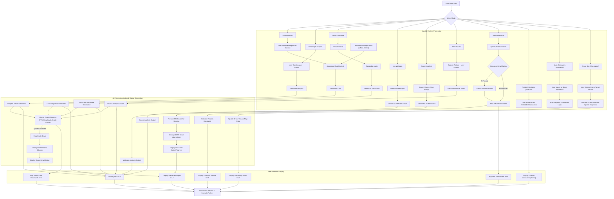

```mermaid
flowchart TD
    A[User Starts App] --> B{Select Mode}

    B --> C1[Chat Assistant]
    B --> C2[Doc/Image Analysis]
    B --> C3[Voice Command]
    B --> C4[Live Webcam]
    B --> C5[Screen Analysis]
    B --> C6[Take Picture]
    B --> C7[Marketing Email]
    B --> C8["Freight Calculators (External)"]
    B --> C9["Basic Estimators (Illustrative)"]
    B --> C10["Drone Sim (Conceptual)"]

    subgraph Input_Context_Processing ["Input & Context Processing"]
        C1 --> I_Chat["User Text/File/Image/Cam Context"]
        KB["Internal Knowledge Base (URLs, DOCX)"] --> CTX_Agg["Aggregate Chat Context"]
        I_Chat --> CTX_Agg
        CTX_Agg --> AI_Chat["Gemini for Chat"]

        C2 --> I_Analysis["User Docs/Images + Prompt"]
        I_Analysis --> AI_Analysis["Gemini for Analysis"]

        C3 --> I_Voice["Record Voice"]
        I_Voice --> VTT["Transcribe Audio"]
        VTT --> AI_Voice["Gemini for Voice Cmd"]

        C4 --> I_Webcam["Webcam Feed Input"]
        I_Webcam --> AI_Webcam["Gemini for Webcam Vision"]

        C5 --> I_Screen["Screen Share + User Prompt"]
        I_Screen --> AI_Screen["Gemini for Screen Vision"]

        C6 --> I_Picture["Capture Picture + User Prompt"]
        I_Picture --> AI_Picture["Gemini for Picture Vision"]

        C7 --> I_Mkt_Contacts["Upload/Enter Contacts"]
        I_Mkt_Contacts --> I_Mkt_Compose{"Compose Email Option"}
        I_Mkt_Compose -- "AI Prompt" --> AI_Mkt_Gen["Gemini for Mkt Content"]
        I_Mkt_Compose -- "Manual/Edit" --> MKT_Content["Final Mkt Email Content"]
        AI_Mkt_Gen --> MKT_Content

        C8 --> I_Calc["User Interacts with Embedded Calculators"]

        C9 --> I_Estim["User Inputs for Basic Estimators"]
        I_Estim --> EST_Logic["Run Simplified Estimations Logic"]

        C10 --> I_Drone["User Selects Drone/Target for Sim"]
        I_Drone --> DRONE_Sim_Logic["Simulate Drone Actions & Update Map Data"]
    end

    subgraph AI_Action_Output ["AI Processing, Action & Output Generation"]
        AI_Chat --> RESP_Chat["Chat Response Generated"]
        AI_Analysis --> RESP_Analysis["Analysis Result Generated"]
        AI_Voice --> RESP_Voice["Voice Cmd Response Generated"]
        AI_Webcam --> RESP_Webcam["Webcam Analysis Output"]
        AI_Screen --> RESP_Screen["Screen Analysis Output"]
        AI_Picture --> RESP_Picture["Picture Analysis Output"]
        MKT_Content --> MKT_Email_Logic["Prepare Mkt Emails for Sending"]
        EST_Logic --> RESP_Estim["Estimator Results Calculated"]
        DRONE_Sim_Logic --> RESP_Drone["Update Drone Visuals/Map Data"]

        RESP_Chat --> O_SharedFeatures["Shared Output Features (TTS, Downloads, Quote Check)"]
        RESP_Analysis --> O_SharedFeatures
        RESP_Voice --> O_SharedFeatures
        RESP_Picture --> O_SharedFeatures

        O_SharedFeatures -- "Quote Check Met" --> EMAIL_Q["Prep Quote Email"]
        EMAIL_Q --> SEND_Q["Attempt SMTP Send (Quote)"]
        SEND_Q --> STAT_Q["Display Quote Email Status"]

        MKT_Email_Logic --> SEND_MKT["Attempt SMTP Send (Marketing)"]
        SEND_MKT --> STAT_MKT["Display Mkt Email Status/Progress"]
    end

    subgraph UI_Display ["User Interface Display"]
        RESP_Chat --> UI_Text["Display Text in UI"]
        RESP_Analysis --> UI_Text
        RESP_Voice --> UI_Text
        RESP_Webcam --> UI_Text
        RESP_Screen --> UI_Text
        RESP_Picture --> UI_Text
        MKT_Content --> UI_MKT_Fields["Populate Email Fields in UI"]
        I_Calc --> UI_Calc_Iframe["Display External Calculators (iframe)"]
        RESP_Estim --> UI_Estim_Results["Display Estimator Results in UI"]
        RESP_Drone --> UI_Drone_Map["Display Drone Map & Info in UI"]
        O_SharedFeatures --> UI_Media["Play Audio, Offer Downloads in UI"]
        STAT_Q --> UI_Status["Display Status Messages in UI"]
        STAT_MKT --> UI_Status
    end

    UI_Text --> Z[User Views Results & Interacts Further]
    UI_Media --> Z
    UI_MKT_Fields --> Z
    UI_Calc_Iframe --> Z
    UI_Estim_Results --> Z
    UI_Drone_Map --> Z
    UI_Status --> Z
```
